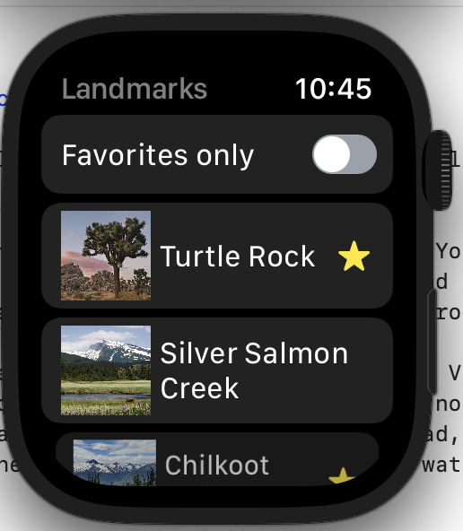
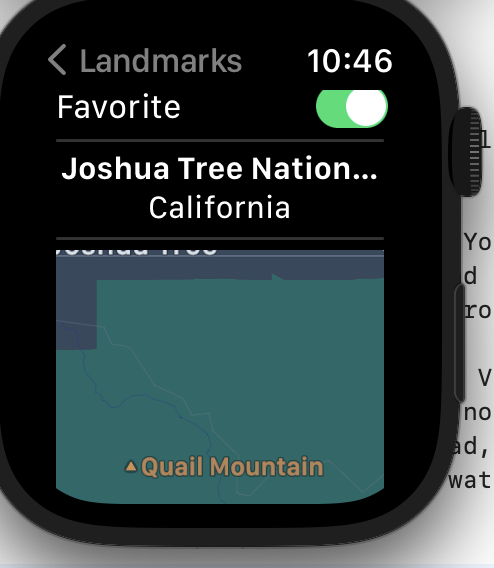
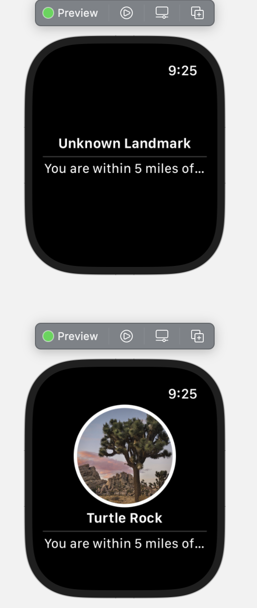

#  Landmarks Apple Watch app 
This demo app is based on the Apple tutorial here: https://developer.apple.com/tutorials/swiftui/creating-a-watchos-app.

If you are stuck getting the project to open in XCode after downloading everything, make sure to click
the `.xcodeproj` UIKit extensions file. 

Nearly, any iOS app can be built into a watchOS app as well! Do not fear, it is an easy process. You
already did the harder process of building your app. From there, by adding the watchOS target, and 
replicating the steps in the Apple tutorial, you can easily add a watchOS companion app to your project.

The app can inherit the same ViewModel/ DataModel used in your regular app as well as some of the Views.
In addition, keep in mind that certain views should be summarized on the WatchOS app. You should not
display all that information on the watchOS that you might display on the larger iOS apps. Instead, only
display what makes sense in the platform's context (often shortened, because of the size of the watch's 
screen).

# Design
## Home page

## Landmark Screens
![Landmark photo(static/landmark1.png)

## Notifications

